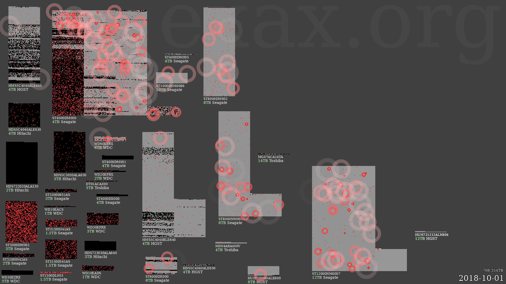

Visualise The Backblaze Dataset
==================================================================

*Exax PyData Global 2021 Talk*



This repository contains the source code and data fetching
instructions for the talk "[Computations as Assets; A New Approach to
Reproducibility and Transparency](https://www.youtube.com/watch?v=J4zvLJn3ya8)", by *Anders Berkeman*, *Carl
Drougge*, and *Sofia Hörberg*, presented at [PyData Global](https://pydata.org/global) 2021-10-28.

By cloning the repository and following the instructions in this
readme, a movie file similar to [this one on Youtube](https://www.youtube.com/watch?v=hW4EqvK2MY0) will be generated.


Clone Repository
----------------

```
git clone https://github.com/exaxorg/backblaze_animation.git
cd backblaze_animation
```


Download Data
-------------

```
cd data

# backblaze data
wget https://f001.backblazeb2.com/file/Backblaze-Hard-Drive-Data/data_Q2_2021.zip
...
```
You'll find all the data files needed at [Backblaze](https://www.backblaze.com/b2/hard-drive-test-data.html#downloading-the-raw-hard-drive-test-data).


Prerequisites
-------------

To create h.264-movies, you need to have [ffmpeg](https://ffmpeg.org)
installed.  (Without it, you can still watch the individual frames
using an image viewer.)  On a Debian-based system, do `apt-get install
ffmpeg`

If there is an error from ImageFont saying "OSError: cannot open
resource", the required fonts are not installed.  On a Debian-based
system, do `apt-get install fonts-dejavu-core`

This will not run on Windows, sorry. (WSL probably works.)


Build
-----

### In a terminal
```
cd backblaze_animation
python3 -m venv venv
source venv/bin/activate
pip install accelerator pillow
ax server
```

### In a second terminal (with ax server running)
```
cd backblaze_animation
source venv/bin/activate

# Run this once to import the data
ax run import

# Run this to create the movie
ax run movie
# You can press CTRL-T while waiting for more verbose progress indication.

# Now, check output in ./results/-directory or in your web browser.
# And try ax --help if you're curious.

# Bonus - the Backblaze AFR (Annual Failure Rate) metric
ax run afr
```


### In a web browser
First, set a board-port in `accelerator.conf`:
```
board listen: localhost 8520
```
Then start board like this
```
ax board-server
```
(Or just restart `ax server`.)


Now, point browser to http://localhost:8520


This is an Exax Accelerator project
-----------------------------------

This means that
 - processing is carried out in parallel, where possible,
 - project is completely traceable and reproducible, and
 - everything is written in Python.

The Accelerator is an open source (Apache V2) project.  See
https://exax.org for more information.
